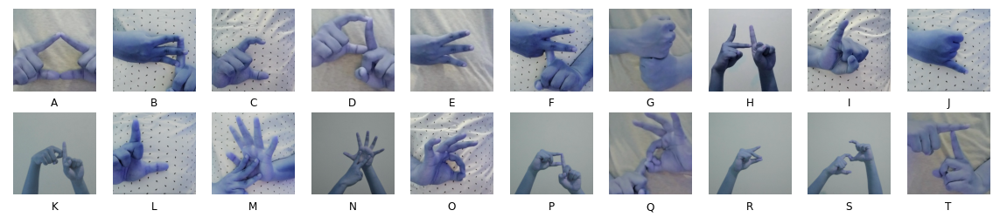
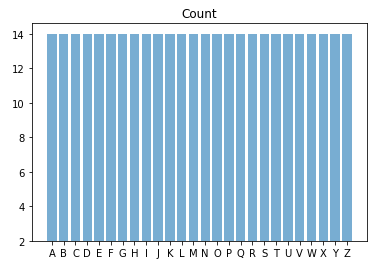
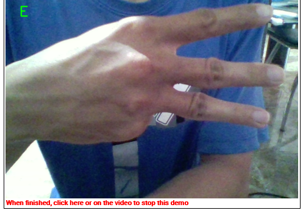

# Project Image Recognition : Pengenalan Bahasa Isyarat Indonesia
___

  

## Problem Statement

Orang dengan gangguan pendengaran umumnya memiliki kesamaan dengan anak-anak,
hanya saja mereka mengalami gangguan pendengaran. Penyandang tunarungu berhak atas
pendidikan, hak bersosialisasi, dan hak untuk menikmati. Penyandang tunarungu, baik dari
orang tua, guru, teman, maupun lingkungan, memerlukan perlakuan khusus. Bahasa isyarat
adalah bahasa yang terus berkembang. Bahasa isyarat merupakan “jembatan” komunikasi
antara Tunarungu dengan Tunarungu dan lainnya.

BISINDO adalah salah satu Bahasa Isyarat Indonesia dan memiliki beberapa fitur untuk
diterapkan. Ini karena penyandang tunarungu dapat mengalami kesulitan menjalani kehidupan
sehari-hari mereka. Oleh karena itu, projek akhir ini berusaha menyediakan sistem untuk
mengenali atau menerjemahkan alfabet BISINDO ke dalam teks. Sistem ini dirancang untuk
memungkinkan orang dengan gangguan pendengaran berkomunikasi dalam dua arah.

## Deskripsi Dataset

  

Dari A sampai Z, file data berisi gambar skala 1:1 bahasa isyarat Indonesia. Gambar diambil
dengan tiga latar belakang yang berbeda: kemeja putih polos, dinding putih, dan kemeja putih
bermotif titik. Bayangan diambil dari depan, dengan jarak kurang lebih 70 cm antara benda dan
lensa. Selama pemotretan, empat gambar diambil untuk setiap latar belakang, dengan total 12
gambar untuk setiap alfabet. Jumlah bayangan yang diperoleh dari huruf A sampai Z adalah

  

dataset : 
- [link_1](https://www.kaggle.com/datasets/achmadnoer/alfabet-bisindo)
- [link_2](https://drive.google.com/file/d/1mlir8h4T_FNX7ep5iHckAlJ8K6-hhE1N/view?usp=sharing)

## Code Lab
1. [Codelab1](1_codeLab_BISINDO_1.ipynb)
    - simple augmentation
    - accuracy 50% underfitting
2. [Codelab2](1_codeLab_BISINDO_2.ipynb)
    - hard augmentation to increase dataset up to 2.080
    - accuracy 71% overfitting
3. [Codelab3](1_codeLab_BISINDO_3.ipynb)
    - hard augmentation to increase dataset up to 364.000
    - but can't handle it too much
    - so it is decreased menjadi 6.500 dataset
    - accuracy 99% 

## General Stage
1. Image Augmentation
   - Tingkat Kecerahan (Brightness)
   - Translasi / Pergeseran citra (Translate)
   - Mengubah Ukuran Citra
   - Memutar Citra (Rotate)

2. Membuat gambar baru sesuai label
3. Iterasi pembuatan model
4. Evaluasi model
5. Prediksi
6. Deployment

## Deployment 

  

## Kesimpulan
masih diperlukan beberapa pengembangan karena model masih sulit memprediksi jika backgroundnya bukan putih polos, baju putih seperti pada dataset sehingga sebaiknya gambar dihilangkan terlebih dahulu kemudian diproses

